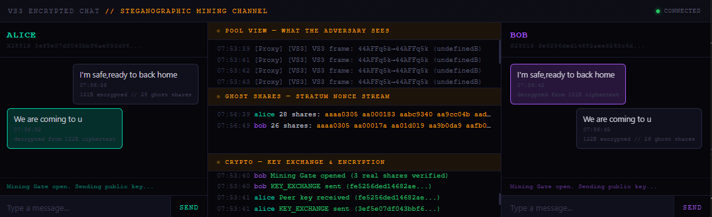
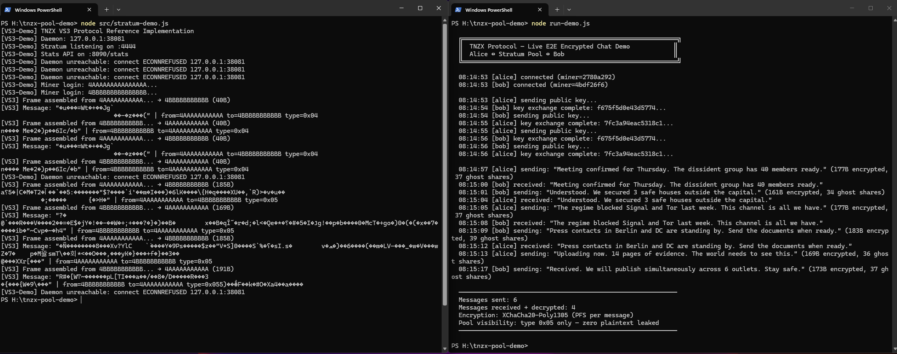
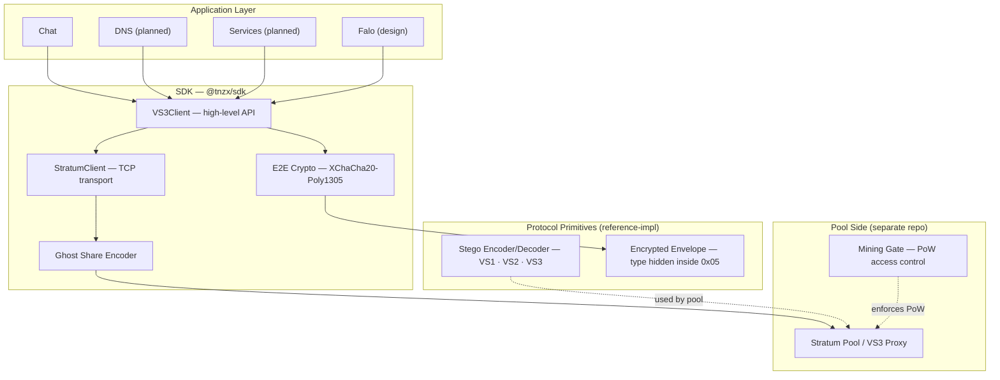
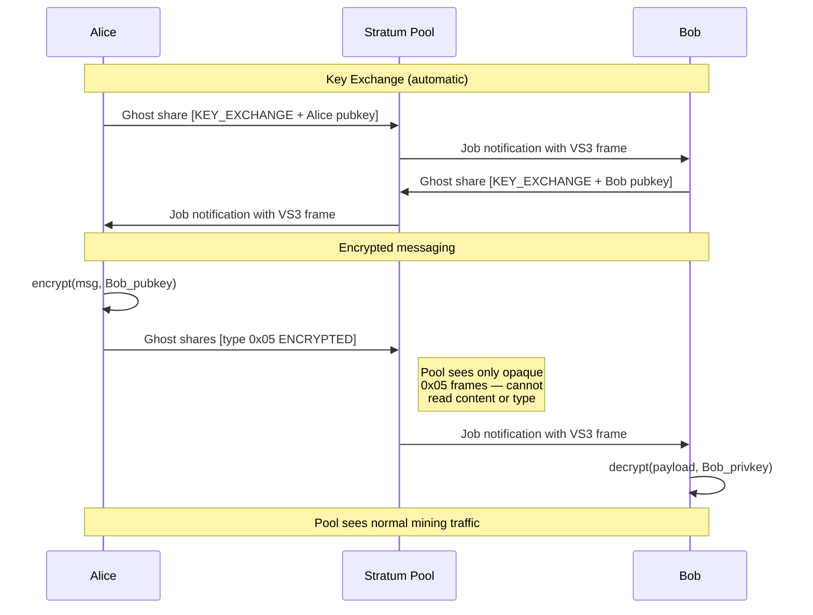

# TNZX Protocol Suite

**Open protocols for censorship-resistant communication over cryptocurrency mining channels.**





*Left: the Stratum pool sees only ghost shares (`nonce=aa...`) and encrypted frames (`type=0x05`). Right: Alice and Bob exchange sensitive messages — decrypted only on the endpoints. The pool operator cannot read, filter, or censor the content. Run it: `node run-demo.js` in [tnzx-pool-demo](https://github.com/tnzx-project/tnzx-pool-demo).*

> **Security notice:** This project is in active research and development. It has not undergone an independent security audit. Do not rely on it to protect life, liberty, or safety without independent verification. The protocol and implementation may contain undiscovered vulnerabilities. We consider honest acknowledgment of these limitations to be essential for a project targeting users in high-risk environments.

---

## What is this?

TNZX is a family of protocols that exploit the inherent randomness of cryptocurrency mining traffic to create covert communication channels. Mining shares — legitimate proof-of-work submissions — carry hidden encrypted payloads that are entropy-equivalent to normal mining data — see the design paper (Section 7.2) for the information-theoretic argument.

The key innovation is **Mining Gate**: communication bandwidth is mathematically bound to proof-of-work. You must mine to message. This creates anti-spam, economic sustainability, and censorship resistance in a single mechanism.

## Architecture



## How it works



## Threat Model

Visual Stratum is designed to protect communication in environments where standard secure-messaging channels (Signal, Tor, VPNs) are blocked or fingerprinted at the network layer.

**Who this protects:**
- Journalists, activists, and human rights defenders under network censorship
- Users in environments with Deep Packet Inspection (DPI) that blocks known privacy tools
- Anyone who needs to communicate covertly through a channel that cannot be selectively blocked without economic consequences

**What it protects against:**
- **ISP-level DPI** that classifies and blocks traffic by protocol fingerprint
- **Pool operator surveillance** (messages are E2E encrypted; the pool cannot read content)
- **Passive network observers** who monitor traffic patterns (mining traffic provides cover)
- **Spam and Sybil attacks** on the communication channel (Mining Gate requires real PoW)

**What it does NOT protect against:**
- **Device compromise** (malware on the endpoint sees plaintext before encryption)
- **Nation-state signals intelligence** with per-connection hash verification (ghost shares have zero PoW and are detectable by an observer who validates every share hash)
- **Global traffic analysis** correlating sender/receiver mining sessions by timing
- **Malicious pool operator (MITM)** — key exchange is currently unauthenticated (trust-on-first-use). A pool operator who actively modifies traffic can inject fake public keys and read messages. Authenticated key exchange is planned.
- **Blocking all mining traffic** (governments can and have banned cryptocurrency mining entirely, e.g., China 2021)

**Assumptions:**
1. Mining traffic is not globally blocked (it has legitimate economic use)
2. The adversary performs protocol classification, not per-share hash validation
3. HMAC sentinel mode is enabled (legacy 0xAA is trivially detectable)
4. E2E encryption is used for message content (transport layer provides stealth, not confidentiality)

For the full security analysis, see the design paper (Section 7, Appendix A).

## Project Status

This repository contains protocol specifications, a design paper, and a reference implementation. The project is in active development. Some components are production-tested; others are at design stage.

| Component | Status | Notes |
|-----------|--------|-------|
| Stratum steganographic embedding (VS1/VS3-Monero) | **Implemented and tested** | Core encoder/decoder in reference impl |
| Stratum steganographic embedding (VS2 Bitcoin-style) | **Specified; demonstrated in pool demo proxy** | Encoding via extranonce2; not in reference impl |
| E2E encryption (X25519 + XChaCha20-Poly1305) | **Implemented and tested** | Session and one-shot modes, replay protection |
| Encrypted type envelope | **Implemented and tested** | All frames use 0x05 ENCRYPTED externally |
| Mining Gate (PoW-gated access) | **Implemented and tested** | State machine, adaptive threshold |
| Developer SDK (`@tnzx/sdk`) | **Implemented and tested** | VS3Client, StratumClient, 40 tests |
| HMAC sentinel (anti-DPI) | **Implemented and tested** | Replaces detectable 0xAA with HMAC-tagged nonce |
| PNG LSB channel (VS1) | **Archived** | Proof-of-concept only; superseded by Stratum channel |
| WebSocket / HTTP/2 channels | **Specified** | Design complete, not in reference impl |
| Multi-channel adaptive routing | **Specified** | Design complete, not in reference impl |
| LZ4 compression | **Specified** | Design complete, not in reference impl |
| Falo (anonymous coordination) | **Design phase** | Identity layer prototyped; ZK proofs, ring signatures not yet implemented |
| Independent security audit | **Pending** | Internal review completed; third-party audit not yet performed |

## Protocols

| Protocol | Version | Description | Status |
|----------|---------|-------------|--------|
| [Visual Stratum 1](protocols/vs1/) | 1.0 | PNG LSB steganography over HTTPS | Archived |
| [Visual Stratum 2](protocols/vs2/) | 2.0 | Mining Gate + Stratum embedding | Specified; demonstrated in pool demo proxy |
| [Visual Stratum 3](protocols/vs3/) | 3.0 | Multi-channel adaptive transport | Partially implemented (Stratum channel only) |
| [Falo](protocols/falo/) | 0.1 | Anonymous coordination via ZK proofs | Design phase |

### Evolution

```
VS1 (2025)          VS2 (2026)              VS3 (2026)
PNG steganography → + Mining Gate         → + Multi-channel transport (design)
45 KB per image     + Stratum embedding     + Adaptive mode selection (design)
HTTPS only          + Economic model        + Timing decorrelation (design)
                    + Anti-spam via PoW
```

## Key Innovations

### 1. Steganographic Mining Communication

Visual Stratum encodes payload bytes in Stratum share fields by having a TNZX-enhanced miner (tnzxminer) constrain specific field bytes to payload values before PoW search. A VS-aware pool extracts the payload; a non-VS pool processes the share normally (or rejects it if it is a ghost share below difficulty threshold). Standard unmodified XMRig does not implement VS encoding.

```
Bitcoin-style V2 share (tnzxminer, extranonce2 preset before mining):
  Normal: { nonce: "a1b2c3d4", extranonce2: "00000001" }
  VS2:    { nonce: "a1b2XX00", extranonce2: "0000XXYY" }
                           ↑payload nibble    ↑ 2 payload bytes preset before PoW search

Monero V3 ghost share (tnzxminer, no PoW required):
  Normal valid share: { nonce: "a1b2c3d4", result: "<valid hash>" }
  VS3 ghost:          { nonce: "aa48656c", result: "<any>", ntime: "hihi XXYY" }
                               ↑ sentinel  3 payload bytes     ↑ TNZX ext field
```

The information-theoretic argument for Stratum channel undetectability is in the design paper (Section 7.2). The PNG channel requires separate steganalysis validation.

### 2. Mining Gate (Proof-of-Work Gated Communication)

Communication requires active mining. This solves three problems simultaneously:

- **Anti-spam**: Every message has a real computational cost
- **Sustainability**: Mining fees fund the infrastructure
- **Cover traffic**: Mining traffic is economically motivated and globally distributed

### 3. Multi-Channel Adaptive Transport (Design)

VS3 specifies distribution of messages across four channels with different stealth/bandwidth tradeoffs. The reference implementation currently covers the Stratum channel only. The full multi-channel architecture is specified in the design paper.

| Channel | Bandwidth | Stealth | Direction | Implementation |
|---------|-----------|---------|-----------|----------------|
| Stratum shares | 3–5 B/share (Monero, tnzxminer) · 7 B/share (Bitcoin-style, tnzxminer) | Highest | Upload | **Reference impl** |
| PNG charts (LSB) | 45 KB/image | Highest | Download | Specified |
| WebSocket | 50 KB/s | High | Bidirectional | Specified |
| HTTP/2 streams | 100 KB/s | High | Bidirectional | Specified |

### 4. Falo: Anonymous Coordination (Research)

A design for anonymous group coordination using zero-knowledge proofs, ring signatures, and Merkle tree membership. See [papers/falo/](papers/falo/) for the full design document. Falo is a research direction, not a production protocol.

## Security Properties

| Property | Mechanism | Status |
|----------|-----------|--------|
| **Confidentiality** | XChaCha20-Poly1305 | Implemented, tested |
| **Key Exchange** | X25519 ECDH with ephemeral keys | Implemented, tested |
| **Forward Secrecy** | New keypair per message (one-shot mode) | Implemented, tested |
| **Replay Protection** | Nonce tracking with 5-minute TTL | Implemented, tested |
| **Undetectability (Stratum)** | Entropy-equivalent embedding | Implemented; information-theoretic argument |
| **Undetectability (PNG)** | LSB with controlled noise | Specified; formal steganalysis pending |
| **Anti-spam** | Mining Gate (PoW-gated access) | Implemented, tested |
| **Independent audit** | — | Pending |

## Papers

- [Visual Stratum: Mining-Gated Steganographic Communication](papers/visual-stratum/) — Protocol design, specification, and security analysis. Describes both implemented and specified components.

### Research Notes

- [Falo: Anonymous Censorship-Resistant Coordination](papers/falo/) — Design document for zero-knowledge group coordination over mining channels. Core cryptographic modules (ring signatures, ZK proofs) are in design phase. Of particular interest: Section 10 explores the human psychology of anonymous organizing.

## Reference Implementation

A reference implementation in Node.js is provided in [`reference-impl/`](reference-impl/). It includes:

- Steganographic encoder/decoder (VS1/VS2/VS3 Stratum embedding)
- E2E encryption (X25519 + XChaCha20-Poly1305 + HKDF + replay protection)
- Mining Gate verification (PoW-gated access control)
- Compact session encryption (prototype) — counter-based HKDF with ChaCha20-Poly1305, 32-byte overhead vs 88-byte standard (-64%)
- Encrypted type envelope (`wrapTypedPayload`/`unwrapTypedPayload`) — all frames show `0x05 ENCRYPTED` on the wire
- Test suite: 90 tests across 3 suites (`node test.js` + `node crypto/test-xchacha20.js` + `node crypto/test-compact-session.js` — no external dependencies)

**Not included in reference implementation** (specified in paper, planned for a future release):
- PNG LSB steganographic channel
- WebSocket and HTTP/2 transport channels
- LZ4 compression and padding
- Multi-channel routing and timing decorrelation
- Dummy traffic generation

## SDK — `@tnzx/sdk`

A developer SDK is provided in [`packages/sdk/`](packages/sdk/). It wraps the protocol primitives into a high-level API for building applications on TNZX.

**Quick start** (10 lines):

```js
const { VS3Client } = require('@tnzx/sdk');

const client = new VS3Client({ pool: 'host:3333', wallet: '4...' });

client.on('ready', () => console.log('Connected'));
client.on('peer', ({ wallet }) => client.send(wallet, 'Hello TNZX'));
client.on('message', ({ text }) => console.log(text));
client.connect();
```

**Two-tier API:**

| Tier | Class | Use case |
|------|-------|----------|
| High-level | `VS3Client` | Auto key exchange, auto encryption, event-driven messaging |
| Low-level | `StratumClient` | Manual frame control, custom MSG_TYPEs, pool integration |

**Also exports:** `encryptOneShot`, `decryptOneShot`, `generateKeyPair`, `buildVS3Frame`, `hmacSentinel`, `MSG_TYPE`

Zero external dependencies. Node.js >= 18. 40 tests across 6 suites. See [`packages/sdk/examples/`](packages/sdk/examples/) for working examples.

## Test Vectors

Interoperability test vectors are provided in [`test-vectors/`](test-vectors/) for all protocol versions.

## Pool Implementation

This repository contains the protocol specification and a reference implementation of the *client-side* components (encoding, encryption, Mining Gate verification). The *pool-side* implementation — a VS3-aware Stratum server and a VS3 middleware proxy — is in a separate repository:

**[tnzx-project/tnzx-pool-demo](https://github.com/tnzx-project/tnzx-pool-demo)** — VS3-aware pool + proxy POC

It includes:
- `src/stratum-demo.js` — XMRig-compatible Stratum server with ghost share detection, frame reassembly, and bidirectional message routing (~730 lines)
- `poc/vs3-proxy.js` — VS3 middleware proxy that works with any unmodified Stratum pool (~830 lines)
- Test suite: proxy interception, HMAC sentinel validation, DPI steganalysis (chi-squared)
- Timestamped transcripts from production pool tests (HashVault for Monero, Braiins for Bitcoin)

The pool demo runs locally with no Monero daemon and no external dependencies. Two parties can exchange messages through the pool using three terminal windows.

## Comparison with Existing Systems

This table compares design properties, not deployment maturity. Tor and Signal are battle-tested systems with years of independent auditing and massive user bases — advantages that Visual Stratum does not have.

| System | Undetectable Traffic | No KYC | Spam-Resistant | Self-Funding | Maturity |
|--------|---------------------|--------|----------------|--------------|----------|
| Tor (+obfs4) | Disguised | Yes | No | Grants | 20+ years, extensively audited |
| Signal | No (identifiable) | Phone # | No | Grants+Foundation | 10+ years, audited |
| I2P | Partially | Yes | No | Donations | 20+ years, partially audited |
| Bitmessage | Broadcast | Yes | Partial | No | 10+ years, not audited |
| **Visual Stratum** | **Economic cover** | **Yes** | **Yes (PoW)** | **Yes (mining)** | **New (2025), not yet audited** |

Visual Stratum's advantage is undetectable transport (real mining traffic, not synthetic cover). Its current disadvantages are a small user base, no independent audit, and the requirement to actively mine. We consider honest acknowledgment of these limitations to be essential for a project targeting users in high-risk environments.

## Applications

See [APPLICATIONS.md](APPLICATIONS.md) for intended use cases — journalists, activists, human rights defenders, and populations under censorship.

## License

LGPL-2.1. See [LICENSE](LICENSE).

## Citation

```bibtex
@misc{tnzx2026vs,
  title={Visual Stratum: Steganographic Communication via Cryptocurrency Mining},
  author={TNZX Project},
  year={2026},
  url={https://github.com/tnzx-project/tnzx-protocol}
}
```

## Contact

- Protocol questions: tnzx@proton.me
- Security issues: See [SECURITY.md](SECURITY.md)


